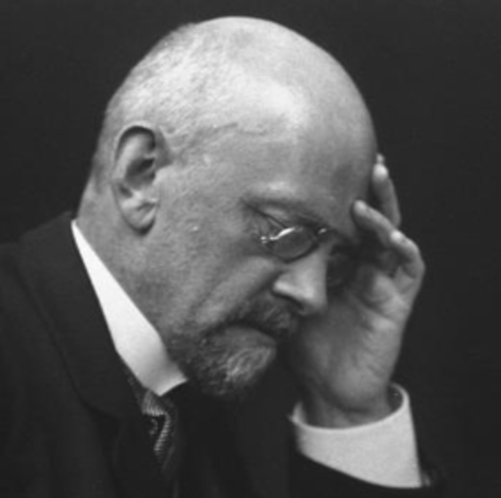
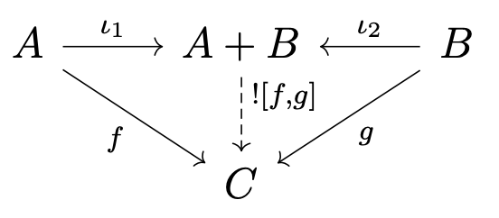
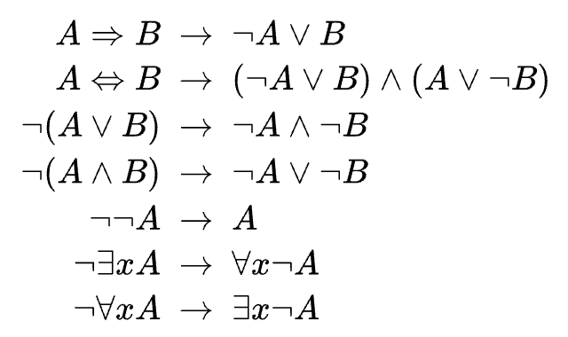
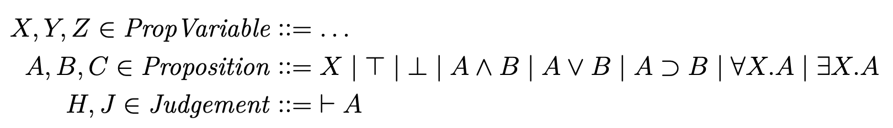
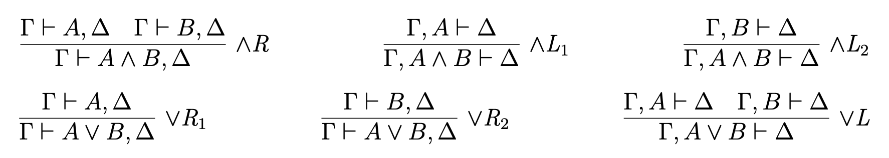
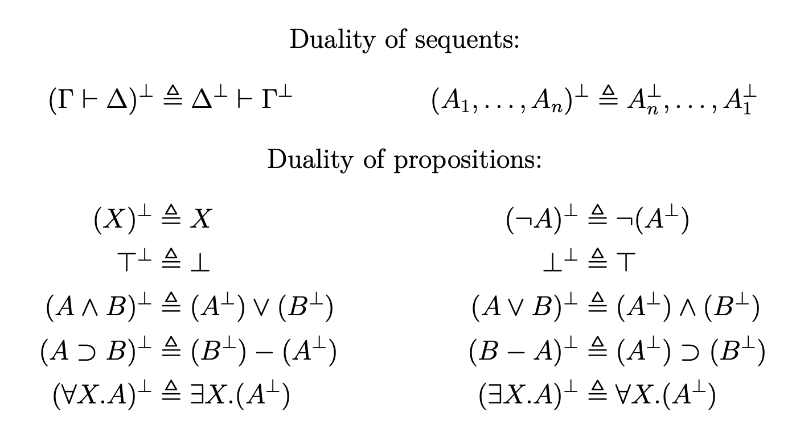
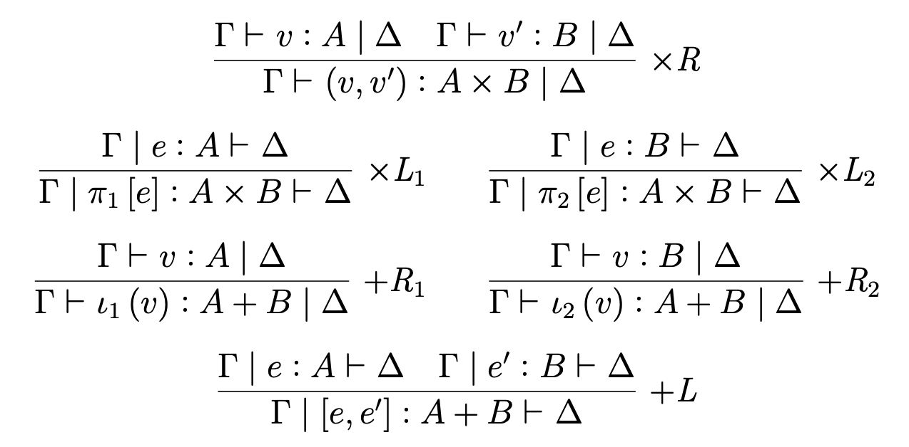
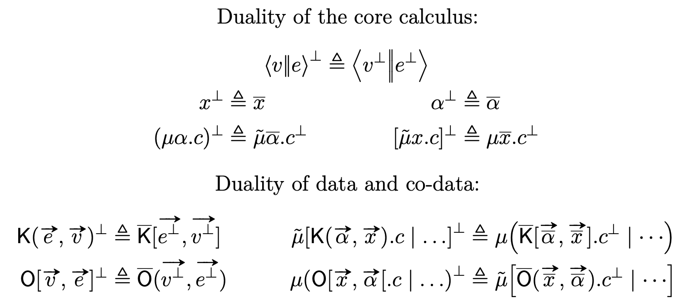

# The Duality of Computation

---

- Let us begin by remembering that logical proofs can be turned into programs.
- The 20th century is filled with discoveries of relations between computation and proof theory.


David Hilbert's _decision problem_:

"Is there an effectively calculable procedure that can decide whether a logical statement is true or false?"

---
<style scoped>
section {
  font-size: 1.6rem;
}
</style>

- **1932 - Church introduces the lambda calculus as a formalization of computation**
- **1935 - Gentzen introduces natural deduction and sequent calculus as formalizations of logic**
- 1969 - Howard observes that intuitionistic natural deduction can be interpreted in the typed lambda calculus
- 1974 - Lambek observes that simply-typed lambda calculus can be interpreted in any Cartesian closed category
- 1989 - Filinksi suggests, via categorical duality (and not logic), that values and continuations are duals, as are CBV and CBN reduction
- 1990 - Griffin observes that classical logic corresponds to control flow manipulation
- 1992 - Parigot introduces the $\lambda\mu$ calculus which corresponds to classical natural deduction
- 1998 - Selinger shows duality between CBV and CBN reduction in the $\lambda\mu$ calculus
- **2000 - Curien and Herbelin introduce the $\lambda\mu\tilde{\mu}$ calculus which corresponds to the classical sequent calculus**
- 2003 - Wadler introduces the dual calculus, also based on sequent calculus but with cleaner syntax

---
<style scoped>
img {
    vertical-align: bottom;
}
</style>

- One of the most fascinating and ubiquitous phenomena in mathematics is _duality_.
- Theoreticians value symmetry. Practitioners value the BOGO.
- Given a mathematical object, if there is a way to invert it, we get another object for free.

---

<style scoped>
section {
  font-size: 1.7rem;
}
</style>

## Dual objects in category theory

Just _flip the arrows_




---

<style scoped>
section {
  font-size: 1.6rem;
}
</style>

## Dual objects in logic

- In classical propositional logic, we have De Morgan's laws:



- In modal logic, necessity is dual to possibility

- Proofs are dual to refutations

---

## Dual objects in natural deduction?

- There is a duality between _introduction_ rules and _elimination_ rules for logical connectives due to _logical harmony_.
- Then by Curry-Howard, there should be a duality between e.g. constructors and destructors, function application and function abstraction.

---

Asymmetry in natural deduction
(many premises, only one conclusion)




---

Asymmetry in the simply typed lambda calculus (thanks Howard)


The duality between products and sums is not readily apparent.

---

- Gentzen (1935) introduced the sequent calculus alongside natural deduction as a more _symmetrical_ proof system.

- Sequent calculus proofs can have many premises _and_ many conclusions.

---

Behold the sequent calculus. A conglomerate of propositions:

$A_1, A_2, . . . , An ⊢ B_1, B_2, . . . , Bm$

- Read as “$A_1, A_2, . . .,$ $\bf{and}$ $An$ entail $B_1, B_2, . . .,$ $\bf{or}$ $Bm$”
- Assuming each of $A_1, A_2, . . . , An$ are true then at least one of $B1, B2, . . . , Bm$ must be true.
- Hypotheses on the left. Consequences on the right.

---

This deceptively basic structure lets us talk about:

* Truth. A single consequence without hypotheses.
    $⊢ A$ means “A is true”
* Falsehood. A single hypothesis without consequences.
    $A ⊢$ means “A is false”
* Contradiction. An empty sequent.
    $⊢$ is a primitive contradiction “true entails false”

---

- As in natural deduction, inference proceeds by making use of logical and structural rules to reach the desired conclusion.

- In addition to introduction and elimination rules for logical connectives, we now also have _left_ and _right_ rules, since we can choose to focus either on the _hypotheses_ or the _consequences_.

- Gentzen's LK system uses sequent calculus to benefit from its natural syntactical symmetry. It can be used to study the dualities of logic.

---

Gentzen's LK (not all of it)




---

Logical duality of LK

```
For any LK proof D of the sequent Γ ⊢ ∆, there exists a dual proof D⊥ of the dual sequent ∆⊥ ⊢ Γ⊥
```




---
<style scoped>
section {
  font-size: 1.8rem;
}
</style>

A proof that $A \land (\neg A)$ is false (LNC)


Can be dualized to a proof of $A \lor (\neg A)$ (LEM)


---

- Natural deduction syntax lacks duality.
    - It is concerned only with _truth_, while sequent calculus can express both _truth_ and _falsehood_.

- Sequent calculus can prove LEM, so it is a proof system for classical logic.

- Griffin (1990) found that classical logic can be computed in the lambda calculus extended with control operators - i.e. first-class continuations.

- What would a programming language based on LK look like?

---

Curien and Herbelin's (2000) $\lambda\mu\tilde{\mu}$


---

Wadler's (2003) Dual Calculus



---
<style scoped>
section {
  font-size: 1.9rem;
}
</style>

We can think of terms as _producers_ and coterms as _consumers_.

- You create producers with $\mu$ which binds _covariables_ (continuations).

- You create consumers with $\tilde{\mu}$ which binds _variables_ (values).

- You connect a producer $p$ with a consumer $c$ using a command $\langle p \| c\rangle$.

${\bf let}\space x = foo \space in \space bar$
$-------------$
$\mu\alpha.\langle foo \| \tilde{\mu}x.\langle bar \| \alpha\rangle\rangle$

---
<style scoped>
section {
  font-size: 1.8rem;
}
</style>

# Critical Pair

Producers and consumers fight for control, but who wins?

$\langle\mu\alpha.s_1 \| \tilde{\mu}x.s_2\rangle$

Can be substituted (evaluated) one of two ways:

$s_1[\tilde{\mu}x.s_2/\alpha$] or $s_2[\mu\alpha.s_1/x]$

* Call-by-value consists in giving priority to the $\mu$ redexes (values)
* Call-by-name gives priority to the $\tilde{\mu}$ redexes (continuations).
* The dual of call-by-value evaluation is call-by-name evaluation

---
<style scoped>
section {
  font-size: 1.8rem;
}
</style>

Generalize user-defined algebraic data types as producers and consumers


---



---

## It goes deeper...

- [Codata in Action](https://www.microsoft.com/en-us/research/uploads/prod/2020/01/CoDataInAction.pdf)
- Induction and co-induction
    - [Structures for Structural Recursion](https://pauldownen.com/publications/structure-recursion.pdf)
- Polarity of types -- mixing evaluation strategies within the same program
    - [A Polarized Basis for Simple Types](https://pauldownen.com/publications/polar-simple-types.pdf)

---

- A typed core language with first-class continuations is arguably an ideal intermediate language for an optimizing compiler
- [Sequent Core](https://github.com/pdownen/sequent-core)
    - GHC optimizer plugins using a core language based on sequent calculus
- Sequent Core showed that important _join points_ can get destroyed in GHC's optimization passes.
    - GHC extended its Core language to include join points (basically by adding a tag to `let` bindings)
    - [Changing Core is a big deal](https://gitlab.haskell.org/ghc/ghc/-/wikis/sequent-core)

---

## Recommended Reading

[Grokking the Sequent Calculus](https://arxiv.org/pdf/2406.14719)

Learn and play with $\lambda\mu\tilde{\mu}$: https://grokking-sc.github.io/grokking-sc/

Nightmare mode: [A Classical Sequent Calculus with Dependent Types](https://acm-stag.literatumonline.com/doi/fullHtml/10.1145/3230625)
